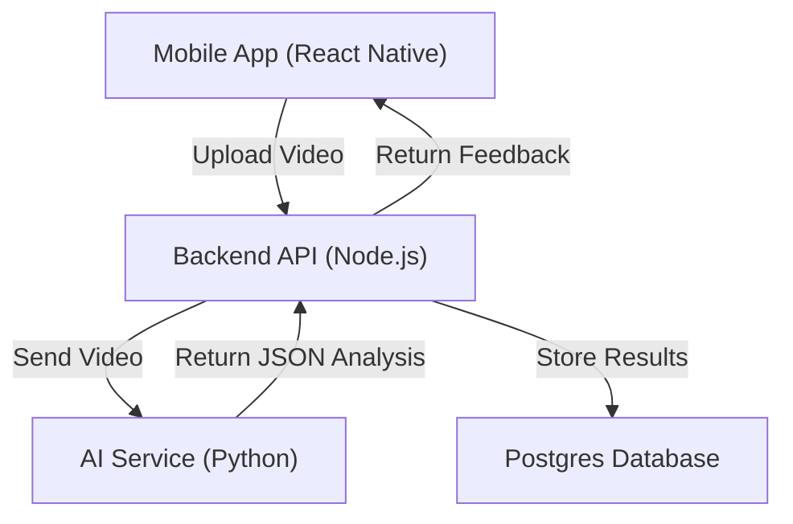
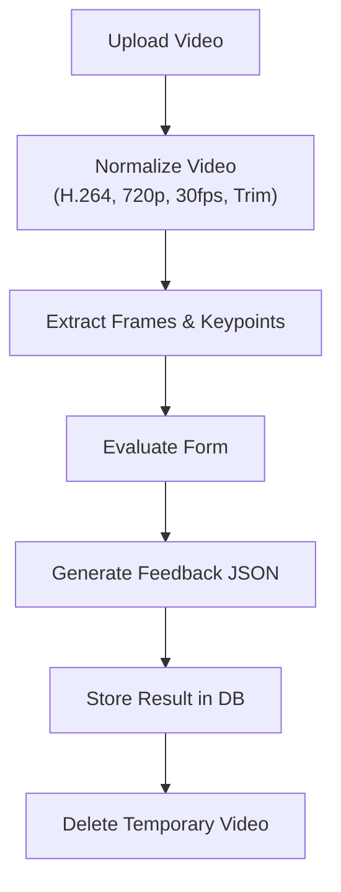

# CaliAI – System Architecture

---

# 1. High-Level Overview

CaliAI follows a Hybrid Monorepo + Microservice architecture with a clear separation between:

- Mobile Client
- Backend API
- AI Processing Service
- Database

---

---

# 2. System Components

## 2.1 Mobile Application

- Native app (React Native & Expo)
- Handles:
  - User interaction
  - Video recording
  - Uploading media
  - Displaying feedback

## 2.2 Backend API (Node.js)

Responsibilities:

- Authentication
- Session management
- Workout management
- Video metadata storage
- Communication with AI service
- Returning feedback results

## 2.3 AI Service (Python)

Responsibilities:

- Pose estimation
- Keypoint extraction
- Form evaluation logic
- Score calculation
- Feedback generation

Runs as a separate service and communicates via HTTP.

## 2.4 Database (Postgres)

Stores:

- Users
- Sessions
- Exercises
- Feedback results
- Scores

## 2.5 Temporary Media Handling (MVP)

Stores:

- Videos are stored temporarily during analysis
- After processing, raw files are deleted
- Only structured feedback data is persisted
- This reduces storage cost and privacy concerns

### Future enhancement – object storage

For scalability and resilience, a later iteration may offload the temporary blobs to an
object store such as Amazon S3 (or GCP/Azure equivalent). Benefits include:

- avoids filling local disk on API nodes
- enables stateless, horizontally scaled backend instances
- durable storage in case of crashes or retries
- works with serverless deployments

Implementation could use either:

1. backend uploads/transcodes directly to S3 and passes the key to the AI service, or
2. client performs a pre‑signed upload and backend/AI service pulls from S3.

Objects would still be deleted immediately after processing or via a short
automated lifecycle rule.

---

# 3. Request Flow – Video Analysis

1. User records exercise video
2. Mobile uploads video to Backend API
3. Backend:
   - **Temporarily stores video** in local storage while it normalizes/transcodes it.
     The file is not kept long‑term – it exists only for the duration of processing and is
     deleted once the AI service has finished.
   - Creates workout session record (metadata only)
   - Sends video reference or the normalized copy to AI Service
4. AI Service:
   - Analyzes video
   - Generates feedback
   - Returns structured result
5. Backend:
   - Stores analysis result (JSON/metrics) in the database
   - Deletes the temporary video file
   - Returns feedback to user

---

---

# 4. Turborepo Structure

Turborepo is used to manage:

- Mobile app
- API
- AI service
- Shared packages

Benefits:

- Shared TypeScript types
- Unified linting
- Faster builds
- Monorepo consistency

---

# 5. Architecture Principles

- Clear separation of concerns
- Service isolation
- Scalable processing layer
- Clean domain boundaries

---

# 6. Service Communication

## Backend → AI Service

- Communication protocol: HTTP
- Payload type: multipart/form-data (video upload)
- Response type: JSON
- Synchronous (blocking) request

The backend waits for AI processing to complete before responding to the client.

---

# 7. Media Normalization (MVP)

To ensure stable AI processing, all uploaded videos are normalized before analysis.

The backend performs:

- Codec normalization (convert to H.264)
- Container normalization (MP4)
- Resolution downscaling (max 720p)
- Frame rate normalization (30 FPS)
- Duration trimming (max 30 seconds)

This ensures consistent input for the AI service regardless of device origin (iOS, Android, etc.).

---

# 8. AI Service Design

The AI service is stateless.

- It does not persist data.
- It processes a video and returns structured analysis.
- All persistence is handled by the Backend API.

This keeps responsibilities clearly separated and simplifies scaling.
