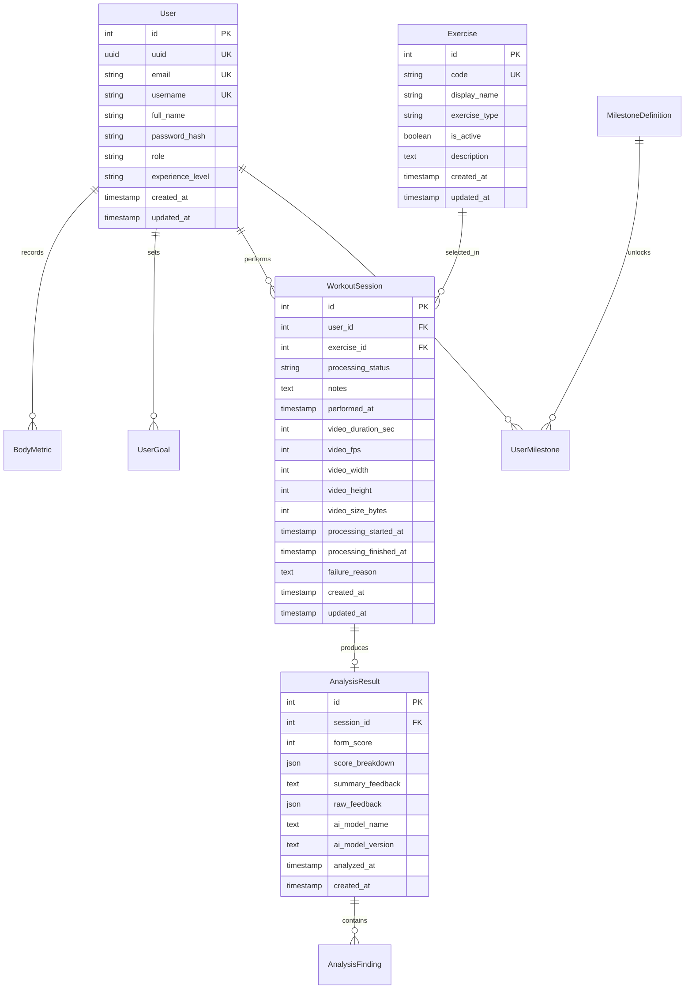

# CaliAI - Data Model (MVP)

## 1. Modeling Goals

This model is designed for the MVP while staying compatible with near-term growth.

- Keep AI service stateless.
- Persist only structured outputs (no long-term raw video files).
- Support session history and progress analytics.
- Keep tables query-friendly for mobile timelines and comparisons.

## 2. Core Relationships

## 3. Enums

`Role`

- `USER`
- `ADMIN`

`ExperienceLevel`

- `BEGINNER`
- `INTERMEDIATE`
- `ADVANCED`

`GoalType`

- `SKILL`
- `STRENGTH`
- `ENDURANCE`
- `MOBILITY`
- `CONSISTENCY`

`GoalStatus`

- `ACTIVE`
- `PAUSED`
- `COMPLETED`
- `DROPPED`

`ExerciseType`

- `DYNAMIC`
- `STATIC_HOLD`

`SessionStatus`

- `PENDING`
- `PROCESSING`
- `COMPLETED`
- `FAILED`

`FindingType`

- `MISTAKE`
- `CORRECTION`
- `POSITIVE`

`FindingSeverity`

- `LOW`
- `MEDIUM`
- `HIGH`

## 4. MVP Tables

### 4.1 `users`

Purpose: authentication profile root.

Fields:

- `id` INT PK (internal relation key).
- `uuid` UUID UNIQUE DEFAULT `uuidv7()` (public identifier).
- `email` TEXT UNIQUE (store normalized lowercase).
- `username` TEXT UNIQUE.
- `full_name` TEXT.
- `password_hash` TEXT.
- `role` `Role` DEFAULT `USER`.
- `experience_level` `ExperienceLevel` DEFAULT `BEGINNER`.
- `created_at` TIMESTAMPTZ DEFAULT `now()`.
- `updated_at` TIMESTAMPTZ.

Indexes:

- unique on `email`, `username`, `uuid`.

### 4.2 `user_goals`

Purpose: user profile goals and objective tracking.

Fields:

- `id` INT PK.
- `user_id` INT FK -> `users(id)` ON DELETE CASCADE.
- `goal_type` `GoalType`.
- `title` VARCHAR(120).
- `target_value` NUMERIC(10,2) NULL.
- `target_unit` VARCHAR(30) NULL (example: `reps`, `seconds`, `sessions_week`).
- `target_date` DATE NULL.
- `status` `GoalStatus` DEFAULT `ACTIVE`.
- `completed_at` TIMESTAMPTZ NULL.
- `created_at` TIMESTAMPTZ DEFAULT `now()`.
- `updated_at` TIMESTAMPTZ.

Indexes:

- `idx_user_goals_user_status` on (`user_id`, `status`).

### 4.3 `body_metrics`

Purpose: measurable physical progress points over time.

Fields:

- `id` INT PK.
- `user_id` INT FK -> `users(id)` ON DELETE CASCADE.
- `height_cm` REAL NOT NULL.
- `weight_kg` REAL NOT NULL.
- `created_at` TIMESTAMPTZ DEFAULT `now()`.

Constraints:

- `weight_kg > 0`.
- `height_cm > 0`.

Indexes:

- `idx_body_metrics_user_created_at_desc` on (`user_id`, `created_at` DESC).

### 4.4 `exercises`

Purpose: catalog of supported exercise types.

Fields:

- `id` INT PK.
- `code` VARCHAR(40) UNIQUE (example: `push_up`, `pull_up`, `squat`, `plank`).
- `display_name` VARCHAR(80).
- `exercise_type` `ExerciseType`.
- `is_active` BOOLEAN DEFAULT `true`.
- `description` TEXT NULL.
- `created_at` TIMESTAMPTZ DEFAULT `now()`.
- `updated_at` TIMESTAMPTZ.

Indexes:

- unique on `code`.

### 4.5 `workout_sessions`

Purpose: one user attempt/video submission for a selected exercise.

Fields:

- `id` INT PK.
- `user_id` INT FK -> `users(id)` ON DELETE CASCADE.
- `exercise_id` INT FK -> `exercises(id)`.
- `processing_status` `SessionStatus` DEFAULT `PENDING`.
- `notes` TEXT NULL.
- `performed_at` TIMESTAMPTZ DEFAULT `now()`.
- `video_duration_sec` NUMERIC(6,2) NULL.
- `video_fps` NUMERIC(6,2) NULL.
- `video_width` INT NULL.
- `video_height` INT NULL.
- `video_size_bytes` BIGINT NULL.
- `processing_started_at` TIMESTAMPTZ NULL.
- `processing_finished_at` TIMESTAMPTZ NULL.
- `failure_reason` TEXT NULL.
- `created_at` TIMESTAMPTZ DEFAULT `now()`.
- `updated_at` TIMESTAMPTZ.

Constraints:

- video_duration_sec > 0.
- video_fps > 0.
- video_width > 0.
- video_height > 0.
- video_size_bytes > 0.

Indexes:

- `idx_sessions_user_performed_at_desc` on (`user_id`, `performed_at` DESC).
- `idx_sessions_user_exercise_performed_at_desc` on (`user_id`, `exercise_id`, `performed_at` DESC).
- `idx_sessions_processing_status` on (`processing_status`).

Notes:

- No raw video blob or storage URL is persisted long-term in MVP.
- Video metadata is persisted for analytics/debugging only.

### 4.6 `analysis_results`

Purpose: structured AI output for a workout session.

Fields:

- `id` INT PK.
- `session_id` INT UNIQUE FK -> `workout_sessions(id)` ON DELETE CASCADE.
- `form_score` SMALLINT CHECK (`form_score BETWEEN 0 AND 100`).
- `score_breakdown` JSONB NOT NULL DEFAULT `'{}'::jsonb`
  (example keys: `posture`, `range_of_motion`, `stability`, `symmetry`).
- `summary_feedback` TEXT NULL.
- `raw_feedback` JSONB NOT NULL DEFAULT `'{}'::jsonb`.
- `ai_model_name` VARCHAR(80) NULL.
- `ai_model_version` VARCHAR(40) NULL.
- `analyzed_at` TIMESTAMPTZ DEFAULT `now()`.
- `created_at` TIMESTAMPTZ DEFAULT `now()`.

Indexes:

- unique on `session_id`.
- `idx_analysis_results_analyzed_at` on (`analyzed_at` DESC).

### 4.7 `analysis_findings`

Purpose: queryable mistakes/corrections/positives from one analysis.

Fields:

- `id` INT PK.
- `analysis_result_id` INT FK -> `analysis_results(id)` ON DELETE CASCADE.
- `finding_type` `FindingType`.
- `severity` `FindingSeverity` DEFAULT `MEDIUM`.
- `code` VARCHAR(80) NULL (stable code for analytics, example: `KNEE_VALGUS`).
- `title` VARCHAR(140).
- `description` TEXT.
- `correction` TEXT NULL.
- `body_part` VARCHAR(60) NULL.
- `start_sec` NUMERIC(6,2) NULL.
- `end_sec` NUMERIC(6,2) NULL.
- `sort_order` SMALLINT DEFAULT 0.
- `created_at` TIMESTAMPTZ DEFAULT `now()`.

Indexes:

- `idx_findings_result_type_order` on (`analysis_result_id`, `finding_type`, `sort_order`).
- `idx_findings_code` on (`code`).

## 5. Smart To Add Now (Low Cost, High Future Value)

These are not strictly required to ship MVP but are cheap to add now.

### 5.1 `milestone_definitions`

Purpose: system milestone catalog (seeded/static data).

Fields:

- `id` INT PK.
- `code` VARCHAR(60) UNIQUE (example: `first_session`, `avg_score_80_push_up`).
- `name` VARCHAR(120).
- `description` TEXT.
- `is_active` BOOLEAN DEFAULT `true`.
- `created_at` TIMESTAMPTZ DEFAULT `now()`.

### 5.2 `user_milestones`

Purpose: unlocked milestones for timeline/badges.

Fields:

- `id` INT PK.
- `user_id` INT FK -> `users(id)` ON DELETE CASCADE.
- `milestone_definition_id` INT FK -> `milestone_definitions(id)`.
- `session_id` INT NULL FK -> `workout_sessions(id)` (optional trigger source).
- `unlocked_at` TIMESTAMPTZ DEFAULT `now()`.

Indexes:

- unique on (`user_id`, `milestone_definition_id`).
- `idx_user_milestones_user_unlocked_at_desc` on (`user_id`, `unlocked_at` DESC).

## 6. Query Patterns This Supports

- My session history: `workout_sessions` filtered by `user_id`, ordered by `performed_at DESC`.
- My progress per exercise: join `workout_sessions` `analysis_results` by `exercise_id`.
- Last N scores trend: `analysis_results` through session join, ordered by `analyzed_at`.
- Most common mistakes: aggregate `analysis_findings.code` per user and exercise.
- Goal and milestone dashboard: `user_goals` `user_milestones`.

## 7. Implementation Notes

- Keep UUIDs for public APIs; keep integer IDs for relational performance.
- Keep one `analysis_results` row per session in MVP (`session_id` unique).
- Persist structured AI output (`raw_feedback`/`score_breakdown`) and findings, not media files.
- Seed `exercises` with MVP set: `push_up`, `pull_up`, `squat`, `plank`.
