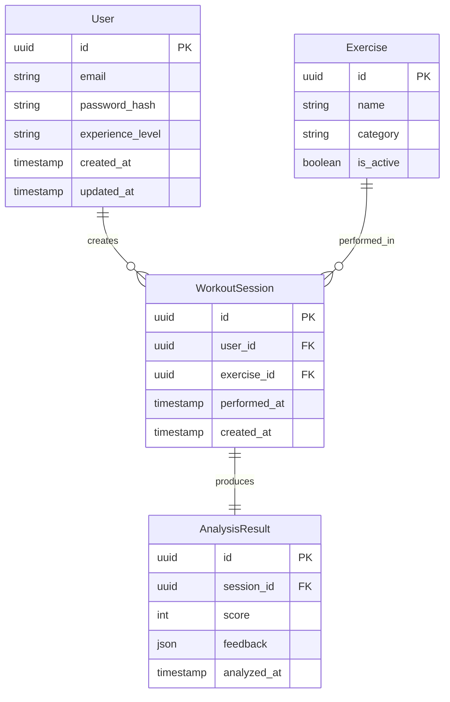

# CaliAI – Data Model

---

# 1. Design Principles

The data model is designed to:

- Keep AI processing stateless
- Store only structured analysis results (not raw videos)
- Support historical performance tracking
- Allow future expansion (training plans, real-time mode, etc.)
- Maintain clean relational boundaries

---

## 4.1 User

Represents a registered athlete.

Fields:

- id (UUID, Primary Key)
- email (Unique, Indexed)
- password_hash
- experience_level (Beginner | Intermediate | Advanced)
- created_at
- updated_at